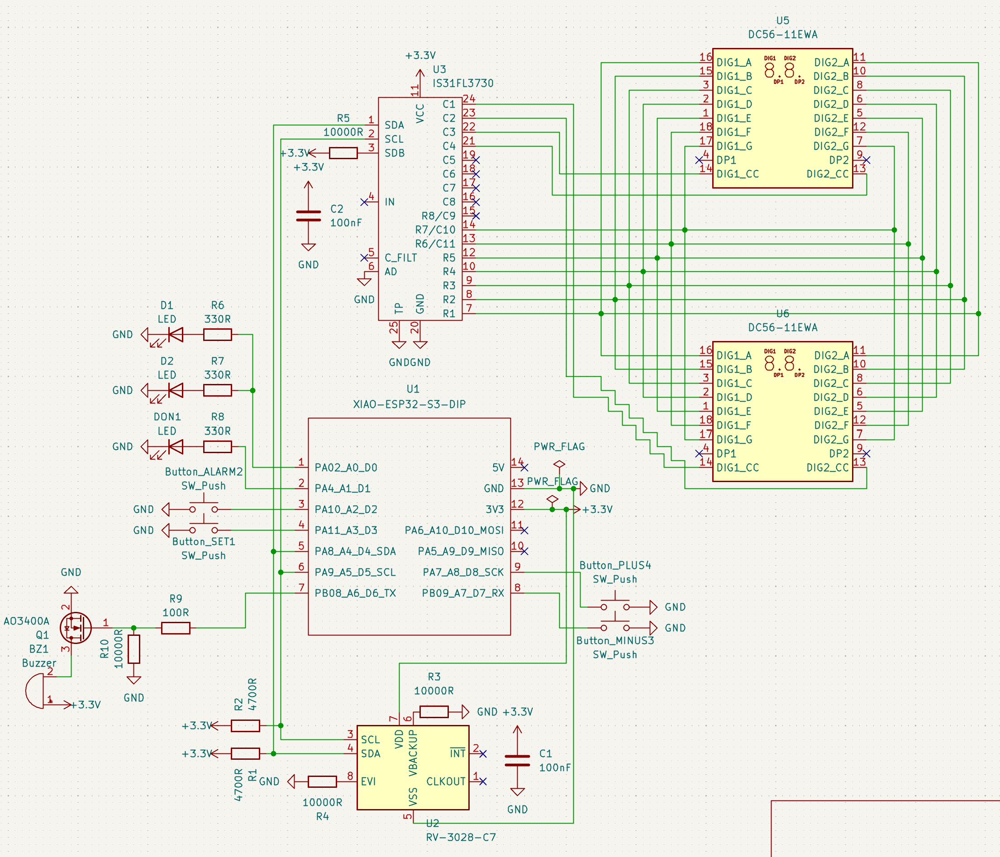
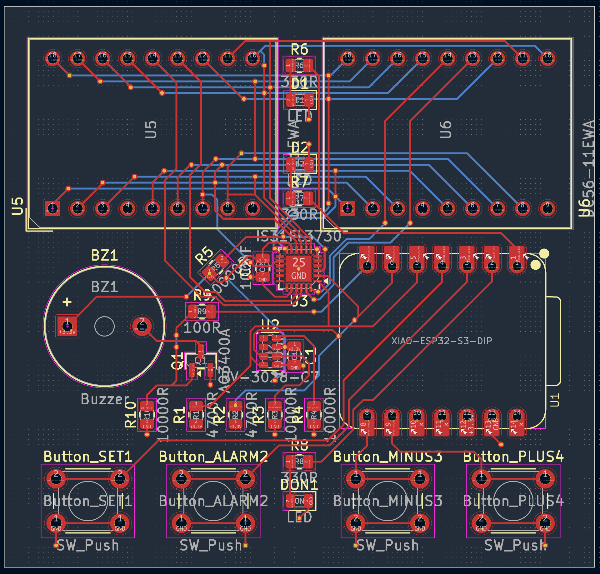
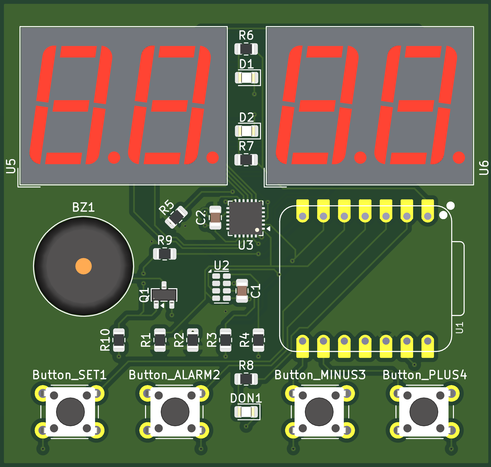
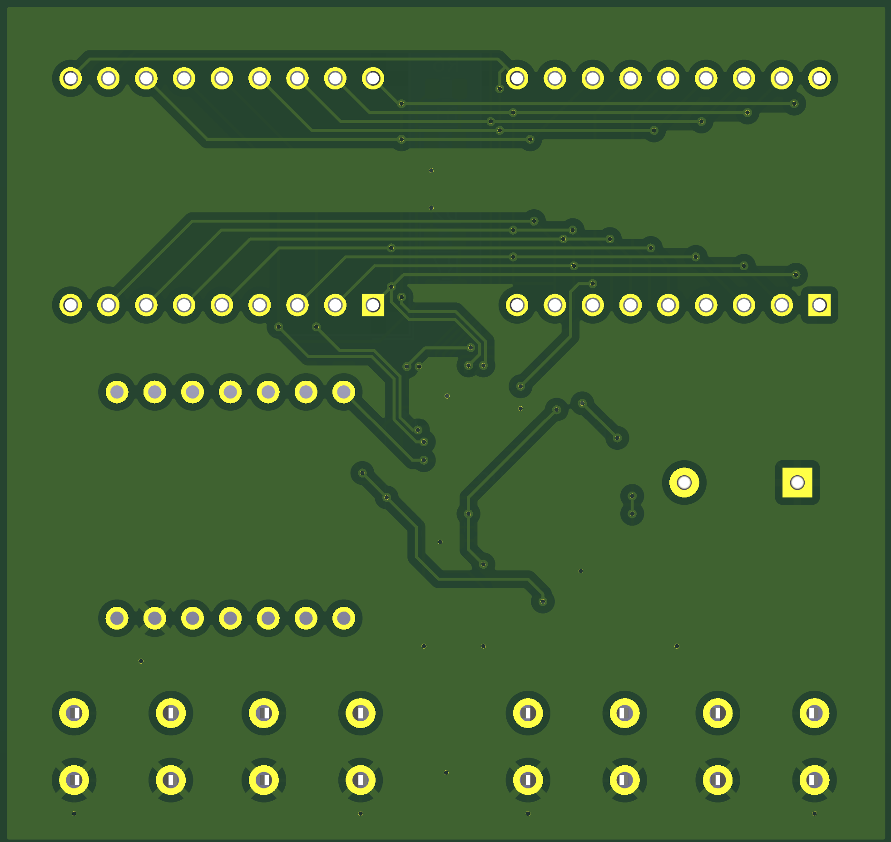
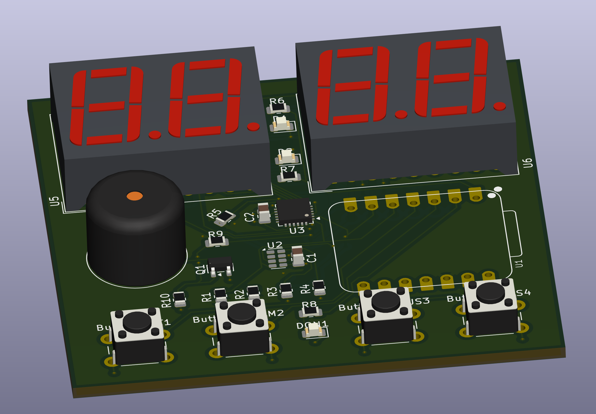

# Projet Réveil Électronique

Projet de conception d’un **réveil électronique** réalisé sous **KiCad**.  
Le dépôt contient le schéma électronique, le PCB routé, les fichiers du projet KiCad ainsi que plusieurs vues du circuit final.

## Présentation du projet

L’objectif est de concevoir un réveil électronique compact capable d’afficher l’heure sur **4 digits 7 segments**, de gérer l’heure grâce à une horloge temps réel, et de proposer une interface utilisateur simple à l’aide de boutons poussoirs.

Le circuit est organisé autour d’un **Seeed Studio XIAO ESP32-S3**, utilisé comme microcontrôleur principal.

Le PCB comprend notamment :

- un **XIAO ESP32-S3** ;
- un **RTC RV-3028-C7** pour la gestion de l’heure ;
- un **IS31FL3730** pour le pilotage des afficheurs ;
- deux afficheurs doubles **DC56-11EWA**, soit 4 digits au total ;
- un buzzer pour l’alarme ;
- un transistor MOSFET **AO3400A** pour commander le buzzer ;
- quatre boutons poussoirs : `SET`, `ALARM`, `MINUS`, `PLUS` ;
- trois LED d’indication ;
- les résistances et condensateurs nécessaires au fonctionnement du montage.

## Fonctionnement général

Le **XIAO ESP32-S3** constitue le cœur du système.

Le **RV-3028-C7** fournit l’heure au microcontrôleur via le bus **I²C** (`SDA` / `SCL`).

Le **IS31FL3730** est également relié au bus I²C et pilote les deux afficheurs 7 segments. Les deux afficheurs doubles permettent d’obtenir un affichage sur quatre chiffres.

Les boutons permettent l’interaction avec le réveil :

- `SET` : réglage ;
- `ALARM` : gestion de l’alarme ;
- `PLUS` : incrémentation ;
- `MINUS` : décrémentation.

Le buzzer est commandé par le XIAO au travers du MOSFET **AO3400A**.

## Schéma électronique

Le schéma final du projet est disponible ci-dessous :



Le fichier source KiCad correspondant est :

`Projet_Réveil_électronique.kicad_sch`

## PCB

Le PCB a été placé et routé sous KiCad sur deux couches :

- **F.Cu** : couche cuivre supérieure ;
- **B.Cu** : couche cuivre inférieure.

Le routage utilise également :

- un plan de cuivre **+3.3 V** sur la face supérieure ;
- un plan de masse **GND** sur la face inférieure.

Vue du PCB final :



Le fichier source du PCB est :

`Projet_Réveil_électronique.kicad_pcb`

## Modèle 3D

### Front view



### Back view



### Perspective view



## Validation KiCad

Le projet a été vérifié avec les outils de contrôle de KiCad.

À la fin du routage :

- **ERC** du schéma : validé ;
- **DRC** du PCB : `0` erreur ;
- **Items non connectés** : `0` ;
- **Parité schématique / PCB** : `0` erreur.

Cela permet de vérifier la cohérence électrique et le routage du projet avant la fabrication.

> La validation ERC/DRC ne remplace pas un test physique du PCB assemblé.  
> Le fonctionnement réel doit être confirmé après soudure et mise sous tension.

## Structure du dépôt

```text
.
├── Projet_Réveil_électronique.kicad_pro
├── Projet_Réveil_électronique.kicad_sch
├── Projet_Réveil_électronique.kicad_pcb
├── Schematic_Réveil_électronique_VF.png
├── PCB_VF.png
├── PCB_3D_Model_Front.png
├── PCB_3D_Model_Back.png
├── PCB_3D_Model_Perspective.png
├── .gitignore
└── README.md
```

## Fichiers principaux

| Fichier | Description |
|---|---|
| `Projet_Réveil_électronique.kicad_pro` | Fichier principal du projet KiCad |
| `Projet_Réveil_électronique.kicad_sch` | Schéma électronique |
| `Projet_Réveil_électronique.kicad_pcb` | PCB routé |
| `Schematic_Réveil_électronique_VF.png` | Image du schéma final |
| `PCB_VF.png` | Vue du PCB final |
| `PCB_3D_Model_Front.png` | Vue 3D avant |
| `PCB_3D_Model_Back.png` | Vue 3D arrière |
| `PCB_3D_Model_Perspective.png` | Vue 3D en perspective |


## Auteur

Projet réalisé dans le cadre du cours `Circuits & Embedded Devices` du `21-23/09/2026`.
